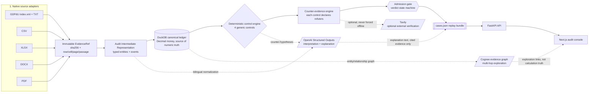
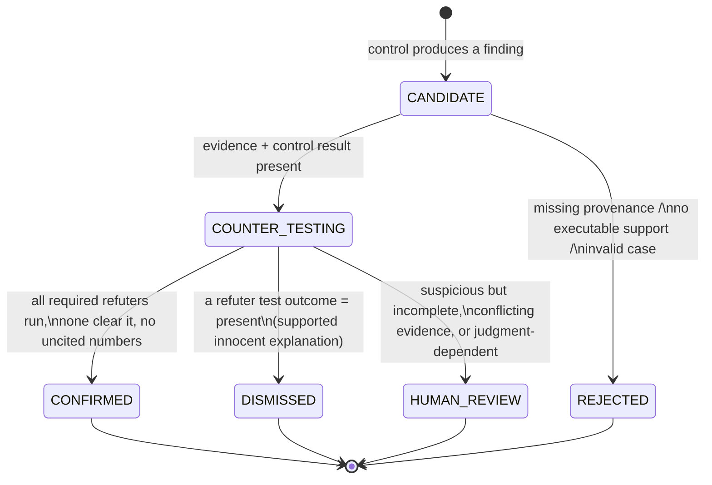
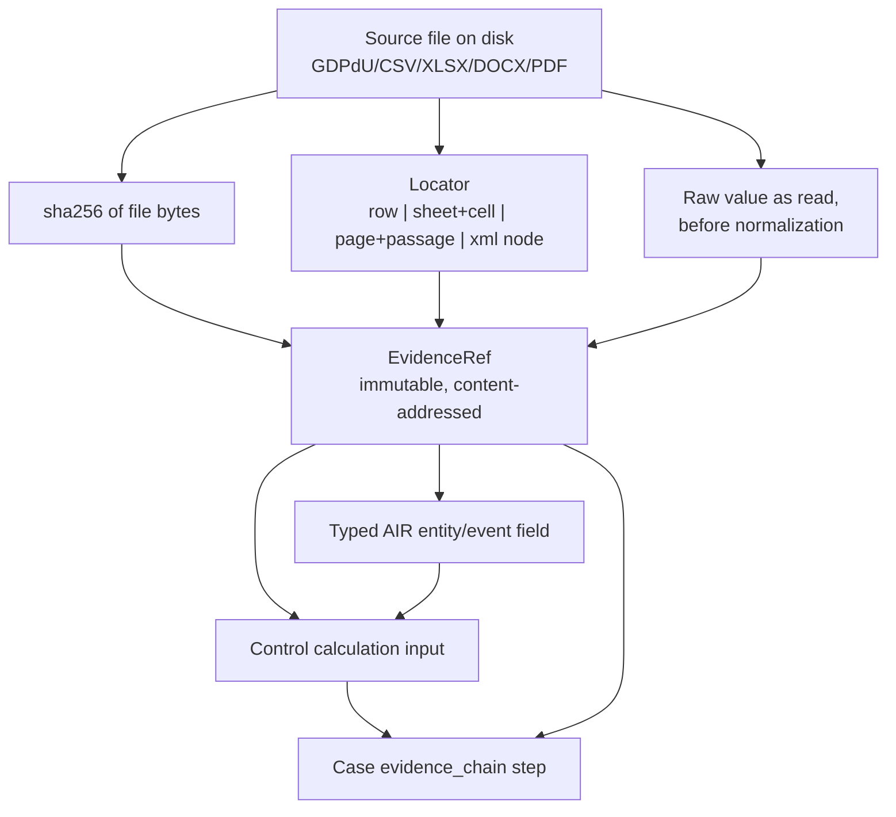

# Architecture

Evidentia turns a heterogeneous accounting dossier into **cases**: fraud/control
findings that are either admitted for human review or dismissed, each one
replayable end to end back to the exact byte in the source file that supports it.

The one design rule everything else follows: **the LLM never computes, matches,
thresholds, or dates anything, and it can never publish a number it didn't get
from evidence.** Arithmetic, joins, and thresholds live in DuckDB and in plain
Python/SQL. The model's job is limited to language: normalizing bilingual terms,
proposing hypotheses, writing explanations, and citing evidence it already has.

## Pipeline



Partner technologies sit **behind interfaces with graceful degradation**: if
`OPENAI_API_KEY`, `COGNEE_LLM_API_KEY`, or `TAVILY_API_KEY` are unset, the
pipeline still compiles, runs controls, and emits cases — it just skips the
interpretive narration, graph exploration, or external corroboration for that
run. Nothing downstream of DuckDB depends on any of them being present.

## Why native parsing

A real general ledger export runs to tens of thousands of rows. Sending that
to a model is slow, expensive, non-deterministic, and — for an audit product —
indefensible: nobody can replay "the model summed it in its head." Instead,
every source format has a native adapter that parses it exactly once into
typed rows with full provenance, and DuckDB does the rest locally:

- sums, joins, and reconciliations are SQL, not prose;
- thresholds and date-window comparisons are typed column comparisons;
- the same query that produced a number is stored next to it and re-executed
  on replay to prove it still holds.

The LLM is invoked only where the input is genuinely ambiguous language — a
German-language DOCX approval policy, a scanned invoice passage, a narrative
description that needs classification — never on the ~20k-row ledger itself.

## Generalization / no hard-coding

The four controls are written against **structural and linguistic features**,
not sample facts:

- vendor integrity / segregation of duties: does the same user account create,
  approve, and pay a vendor within a configurable window, with no independent
  counter-approval?
- split payments below threshold: do same-vendor, same-day (or
  near-same-day) payments sum above a configured approval threshold while each
  individual payment stays under it?
- repairs capitalised as assets: does an expense classified as repair/maintenance
  by its GL account or narrative terms appear instead as a capitalised asset
  addition?
- period cut-off: is an invoice dated in the prior period but posted/paid in
  the next one, with no matching accrual or liability entry?

Every threshold (approval limit, clustering window, capitalisation keyword
list) is **config**, not a literal baked in for the sample dossier. No control
references a specific vendor ID, amount, or filename from the sample data —
that is what lets the same code run unmodified against the unseen final
dossier.

## Admission gate

A finding is not a case until it survives the gate. The gate is the only
place verdicts are decided — never the UI, never the model.



A case cannot reach `CONFIRMED` or `HUMAN_REVIEW` if it contains a fact or
number without a resolving `evidence_id`, if no deterministic control backs
it, or if a required counter-test never ran. `DISMISSED` cases are kept and
shown, not thrown away — a correctly cleared decoy (the "honest twin") is
exactly as much a product output as a confirmed fraud case, because it is
what proves the system isn't just pattern-matching to raise alarms.

## Provenance / EvidenceRef model



Every normalized fact, every control's SQL inputs, and every number rendered
in a case carries one or more `EvidenceRef`s back to this chain. See
[`docs/CASES_SCHEMA.md`](docs/CASES_SCHEMA.md) for the exact `cases.json`
contract and its invariants — those invariants are enforced by the admission
gate, not by the UI trusting the data.

## Module map

```
src/audit_compiler/
├── adapters/       # gdpdu.py, xlsx.py, + csv/docx/pdf — native source parsing, provenance capture
├── ir/             # Audit Intermediate Representation: typed entities + events
├── models.py       # EvidenceRef, shared pydantic models, Decimal-only money
├── normalization.py# locale-aware amount/date normalization (explicit locale, never guessed)
├── duckdb_store.py # canonical ledger: schema, writes, typed queries
├── inventory.py    # dossier walk → file manifest (type, bytes, sha256)
├── compiler.py     # orchestrates adapters → IR → DuckDB, produces the compilation report
├── controls/       # the 4 deterministic controls + their declared counter-evidence refuters
├── llm/            # OpenAI Structured Outputs interface: normalization, hypotheses, explanations
├── graph/          # Cognee evidence-graph adapter (entities, relationships, graceful degrade)
├── external/       # Tavily optional external verification (opt-in, never forced offline)
├── api/            # FastAPI app: engagements, compile, controls, cases, replay, review, evidence
└── cli.py          # `admissible inventory|compile|serve`

web/                # Next.js audit console — reads cases.json read-only, renders the case board,
                     # case file, source viewer, and evidence graph exploration
```

## API endpoints

| Method | Path                          | Purpose |
|--------|-------------------------------|---------|
| POST   | `/engagements`                 | Register a new engagement pointing at a dossier root |
| POST   | `/engagements/{id}/compile`    | Run adapters → IR → DuckDB ledger for the engagement |
| POST   | `/engagements/{id}/controls/run` | Execute the deterministic controls + counter-evidence engine |
| GET    | `/engagements/{id}/cases`     | List cases (case board): verdict, severity, exposure, assertion |
| GET    | `/cases/{id}/replay`          | Full replay bundle: SQL, inputs, evidence, counter-tests, model/prompt version |
| POST   | `/cases/{id}/review`          | Record a human reviewer decision (confirm/dismiss/request work) |
| GET    | `/evidence/{id}`              | Resolve an `evidence_id` to its exact source locator and raw value |
| GET    | `/engagements/{id}/export`    | Export the full `cases.json` replay bundle for an engagement |

Every GET that returns a case or evidence payload is read-only — verdicts are
never mutated by the API serving them, only by the admission gate at compile
time or by an explicit `/cases/{id}/review` call from a human.
