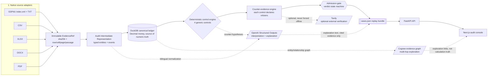
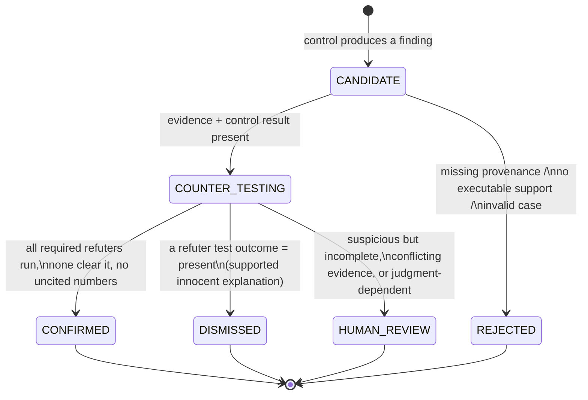
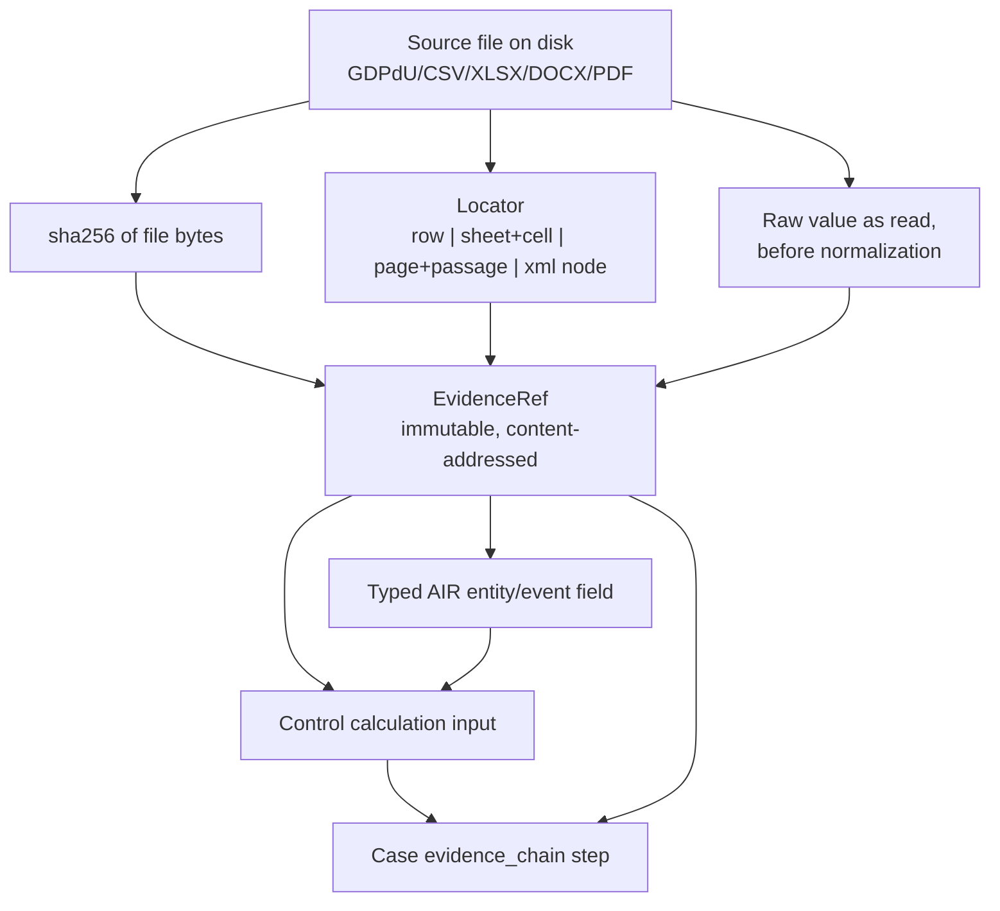
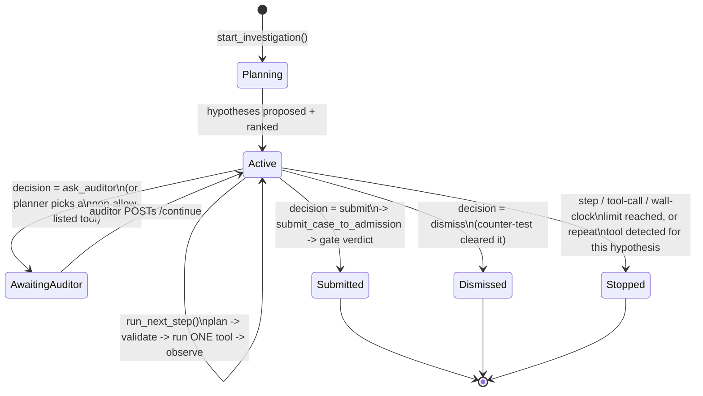
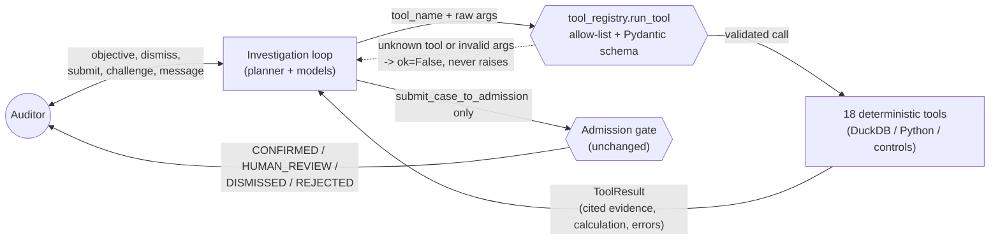

# Architecture

Evidentia turns a heterogeneous accounting dossier into **cases**: fraud/control
findings that are either admitted for human review or dismissed, each one
replayable end to end back to the exact byte in the source file that supports it.

The one design rule everything else follows: **the LLM never computes, matches,
thresholds, or dates anything, and it can never publish a number it didn't get
from evidence.** Arithmetic, joins, and thresholds live in DuckDB and in plain
Python/SQL. The model's job is limited to language: normalizing bilingual terms,
proposing hypotheses, writing explanations, and citing evidence it already has.

## Pipeline



Partner technologies sit **behind interfaces with graceful degradation**: if
`OPENAI_API_KEY`, `COGNEE_LLM_API_KEY`, or `TAVILY_API_KEY` are unset, the
pipeline still compiles, runs controls, and emits cases — it just skips the
interpretive narration, graph exploration, or external corroboration for that
run. Nothing downstream of DuckDB depends on any of them being present.

## Why native parsing

A real general ledger export runs to tens of thousands of rows. Sending that
to a model is slow, expensive, non-deterministic, and — for an audit product —
indefensible: nobody can replay "the model summed it in its head." Instead,
every source format has a native adapter that parses it exactly once into
typed rows with full provenance, and DuckDB does the rest locally:

- sums, joins, and reconciliations are SQL, not prose;
- thresholds and date-window comparisons are typed column comparisons;
- the same query that produced a number is stored next to it and re-executed
  on replay to prove it still holds.

The LLM is invoked only where the input is genuinely ambiguous language — a
German-language DOCX approval policy, a scanned invoice passage, a narrative
description that needs classification — never on the ~20k-row ledger itself.

## Generalization / no hard-coding

The four controls are written against **structural and linguistic features**,
not sample facts:

- vendor integrity / segregation of duties: does the same user account create,
  approve, and pay a vendor within a configurable window, with no independent
  counter-approval?
- split payments below threshold: do same-vendor, same-day (or
  near-same-day) payments sum above a configured approval threshold while each
  individual payment stays under it?
- repairs capitalised as assets: does an expense classified as repair/maintenance
  by its GL account or narrative terms appear instead as a capitalised asset
  addition?
- period cut-off: is an invoice dated in the prior period but posted/paid in
  the next one, with no matching accrual or liability entry?

Every threshold (approval limit, clustering window, capitalisation keyword
list) is **config**, not a literal baked in for the sample dossier. No control
references a specific vendor ID, amount, or filename from the sample data —
that is what lets the same code run unmodified against the unseen final
dossier.

## Admission gate

A finding is not a case until it survives the gate. The gate is the only
place verdicts are decided — never the UI, never the model.



A case cannot reach `CONFIRMED` or `HUMAN_REVIEW` if it contains a fact or
number without a resolving `evidence_id`, if no deterministic control backs
it, or if a required counter-test never ran. `DISMISSED` cases are kept and
shown, not thrown away — a correctly cleared decoy (the "honest twin") is
exactly as much a product output as a confirmed fraud case, because it is
what proves the system isn't just pattern-matching to raise alarms.

## Provenance / EvidenceRef model



Every normalized fact, every control's SQL inputs, and every number rendered
in a case carries one or more `EvidenceRef`s back to this chain. See
[`docs/CASES_SCHEMA.md`](docs/CASES_SCHEMA.md) for the exact `cases.json`
contract and its invariants — those invariants are enforced by the admission
gate, not by the UI trusting the data.

## Investigation agent

Everything above this section describes the v1 compile pipeline: parse once,
run four fixed controls, admit, publish. The investigation agent
(`src/audit_compiler/agent/`) sits on top of the same evidence/controls/gate
stack and adds a **choice of what to check next** — it does not replace or
re-implement any of the pipeline above.

### The bounded loop

`observe -> hypothesise -> rank -> plan -> run ONE tool -> observe -> challenge -> decide -> (admit)`



`InvestigationLimits` (`max_hypotheses=5`, `max_steps=16`, `max_tool_calls=28`,
`max_seconds=120.0`) are checked in `run_next_step`/`run_investigation` before
a tool ever runs — they are code, not a system prompt, so they hold even if
the planner tries to keep going. Repeat detection (the same tool already ran
for the active hypothesis) forces `submit_case_to_admission` instead of
looping. Every step appends a typed event to `Investigation.timeline`
(`hypothesis_created`, `tool_selected`, `tool_result`, `counter_evidence`,
`hypothesis_resolved`, `stopped`, `completed`, ...), so any investigation —
finished or mid-flight — is **replayable**: its full sequence of hypotheses,
tool calls, arguments, and observations can be reconstructed from the
timeline alone.

### Auditor ↔ agent ↔ tools ↔ admission gate



### Tool layer and evidence registry

Every tool is `(ctx: AgentContext, args: <pydantic model>) -> ToolResult`
(`src/audit_compiler/agent/tools.py`), registered in a `ToolSpec` map
(`src/audit_compiler/agent/tool_registry.py`) that pairs the function with
its strict input model (`extra="forbid"`) and a planner-facing description.
`run_tool` is the *only* entry point: it looks up the name, validates raw
arguments against the schema, and calls the function — a `KeyError` or
`ValidationError` becomes an `ok=False` `ToolResult`, never an exception that
reaches the loop. Tools do not reimplement detection logic; they call the
same four controls used by the v1 pipeline (`audit_compiler.controls`) and
translate `Finding`/`Calculation` objects into cited `ToolResult` payloads.

`AgentContext` (`src/audit_compiler/agent/context.py`) is the shared handle a
tool receives: the compiled dossier, the `EvidenceRegistry`, and run
parameters. `EvidenceRegistry` (`src/audit_compiler/agent/evidence_registry.py`)
assigns every evidence pointer a **stable, deterministic, citeable id**
(`ev_<sha256("path|row|sheet|cell|page|raw_value")[:16]>`) the first time a
tool cites it, and `validate()` rejects any id that was never actually
recorded — this is the mechanical enforcement behind "the model can only
cite evidence it already has."

### Planner split

Three interchangeable implementations behind one `Planner` protocol
(`src/audit_compiler/agent/planner.py`):

- **`DeterministicPlanner`** — no LLM. Derives hypotheses from the dossier's
  available controls and drives a genuine per-category tool sequence
  (`_PLAN`), including the required counter-evidence tools, ending in
  `submit_case_to_admission`. Used offline and in tests.
- **`OpenAIPlanner`** — Structured Outputs (`client.beta.chat.completions.parse`)
  for `propose_hypotheses`, `next_action`, and `decide`. Constrained by
  system prompt *and* mechanically by the allow-list/registry boundary
  downstream — it can name a tool or entity id, but the loop enforces that
  the name and ids are real.
- **`HybridPlanner`** (**default** via `get_planner()` when `OPENAI_API_KEY`
  is set) — OpenAI's hypotheses are merged with the deterministic planner's,
  guaranteeing every available control category gets a hypothesis, then
  execution (`next_action`) and closure (`decide`) always use the
  deterministic per-category plan. This is "OpenAI plans and interprets;
  code decides how to verify."

### Cognee memory

`CogneeMemory` (`src/audit_compiler/agent/cognee_memory.py`) gives the agent
a durable, queryable memory of investigations, hypotheses, entities, and
their relationships. A local `InMemoryGraph`
(`src/audit_compiler/graph/interface.py`) is the deterministic source of
truth for every structural query (`get_neighbors`, multi-hop traversal); a
best-effort mirror POSTs the same facts to the Cognee cloud REST API
(`add_text` per node/edge write, background `cognify`, `search` in the fast
`CHUNKS` mode for enrichment) whenever `COGNEE_API_URL` + `COGNEE_API_KEY`
are configured. Every cloud call is wrapped so a missing key, unreachable
network, or non-2xx response is caught and logged, never raised — `.available`
tells a caller whether the cloud path is even attempted. A parallel small
set of Cognee-backed *tools* (`src/audit_compiler/agent/cognee_tools.py`)
exposes this memory in the same `(ctx, args) -> ToolResult` shape as the
deterministic tools, for future inclusion in the planner's allow-list (see
[`REMAINING_RISKS.md`](REMAINING_RISKS.md)).

### Store

`InvestigationStore` (`src/audit_compiler/agent/store.py`) is a deliberately
simple process-wide in-memory registry: compiled engagements (an
`AgentContext` + its `cases.json` bundle) keyed by `engagement_id`, and
`Investigation` objects keyed by `investigation_id`. No persistence, no
locking — the loop mutates `Investigation` in place and the API re-serializes
it on every response. `POST /engagements/upload` registers a new engagement
here; `POST /investigations` and every subsequent step read/write through it.

## Module map

```
src/audit_compiler/
├── adapters/       # gdpdu.py, xlsx.py, + csv/docx/pdf — native source parsing, provenance capture
├── ir/             # Audit Intermediate Representation: typed entities + events
├── models.py       # EvidenceRef, shared pydantic models, Decimal-only money
├── normalization.py# locale-aware amount/date normalization (explicit locale, never guessed)
├── duckdb_store.py # canonical ledger: schema, writes, typed queries
├── inventory.py    # dossier walk → file manifest (type, bytes, sha256)
├── compiler.py     # orchestrates adapters → IR → DuckDB, produces the compilation report
├── controls/       # the 4 deterministic controls + their declared counter-evidence refuters
├── llm/            # OpenAI Structured Outputs interface: normalization, hypotheses, explanations
├── graph/          # Cognee evidence-graph adapter (entities, relationships, graceful degrade)
├── external/       # Tavily optional external verification (opt-in, never forced offline)
├── agent/          # investigation agent: models, evidence registry, tools, tool_registry,
│                   # planner (deterministic/OpenAI/hybrid), loop, cognee_memory/cognee_tools, store
├── api/            # FastAPI app: engagements (compile/upload), cases, replay, review, evidence,
│                   # plus investigations.py — the investigation-agent HTTP surface
└── cli.py          # `admissible inventory|compile|serve`

web/                # Next.js audit console — reads cases.json read-only, renders the case board,
                     # case file, source viewer, and evidence graph exploration
```

## API endpoints

| Method | Path                          | Purpose |
|--------|-------------------------------|---------|
| POST   | `/engagements`                 | Register a new engagement pointing at a dossier root |
| POST   | `/engagements/{id}/compile`    | Run adapters → IR → DuckDB ledger for the engagement |
| POST   | `/engagements/{id}/controls/run` | Execute the deterministic controls + counter-evidence engine |
| GET    | `/engagements/{id}/cases`     | List cases (case board): verdict, severity, exposure, assertion |
| GET    | `/cases/{id}/replay`          | Full replay bundle: SQL, inputs, evidence, counter-tests, model/prompt version |
| POST   | `/cases/{id}/review`          | Record a human reviewer decision (confirm/dismiss/request work) |
| GET    | `/evidence/{id}`              | Resolve an `evidence_id` to its exact source locator and raw value |
| GET    | `/engagements/{id}/export`    | Export the full `cases.json` replay bundle for an engagement |

Every GET that returns a case or evidence payload is read-only — verdicts are
never mutated by the API serving them, only by the admission gate at compile
time or by an explicit `/cases/{id}/review` call from a human.

The investigation-agent endpoints (`POST /engagements/upload`,
`/investigations`, `/investigations/{id}/run-next|run|timeline|graph`, and
the per-hypothesis `dismiss|submit|continue|challenge` + `/messages` actions)
are documented in full in [`README.md`](README.md#api-reference) alongside
this table.
