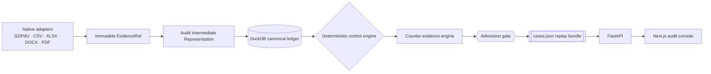

# Evidentia

An evidence-first audit compiler that turns a mixed German/English accounting
dossier into replayable, provenance-backed fraud cases.

> **Models understand. Code verifies. Auditors decide.**

Evidentia is not a chat-with-your-PDFs tool. It is built to be handed an
**unseen** dossier at judging time and produce the same class of result it
produces on the sample — with zero code changes — because every control is
deterministic, every number is sourced, and the model is never on the critical
path for arithmetic, matching, thresholds, or dates.

## What it does

Given a folder of GDPdU exports, CSVs, XLSX workbooks, Word policy documents,
and PDF invoices, Evidentia:

1. natively parses every source format and hashes every file and every field
   it reads, preserving exact row/cell/page/passage locators;
2. normalizes bilingual (German/English) amounts and dates with an explicit
   locale — never a guess;
3. loads everything into a local DuckDB ledger as the single source of
   numeric truth;
4. runs four generic, config-driven controls (vendor integrity /
   segregation of duties, split payments below threshold, repairs
   capitalised as assets, period cut-off) as SQL/Python, not model prompts;
5. runs each control's declared **counter-evidence** tests — independent
   approval, matching deliverables, prior history, matched accruals — and
   only then admits a verdict;
6. emits a single `cases.json` replay bundle that a Next.js console renders
   read-only, where every displayed number is clickable to the exact source
   locator that produced it.

Dismissed anomalies — cases where a control fired but a genuine innocent
explanation cleared it — are a first-class output, not noise. Correctly
clearing an honest "twin" of a fraud pattern is exactly what a false-positive
penalty is measuring, and Evidentia surfaces those dismissals with the same
evidentiary rigor as a confirmed case.

## Why this, not a PDF chatbot

- **Interpretation is separated from proof.** The LLM handles ambiguous
  language: bilingual terminology, hypothesis generation, and plain-language
  explanation. It never performs the arithmetic, the joins, the threshold
  comparisons, or the date logic that decide a case — those are deterministic
  code and SQL, and they run identically whether or not any model is
  reachable.
- **No number is ever uncited.** Every amount in a case's narrative,
  calculation, or financial exposure must resolve to an `evidence_id`
  pointing at an exact byte range in a source file. The admission gate
  enforces this, not the UI.
- **Generalization over sample polish.** Controls read structural and
  linguistic features (same-user create+approve+pay, same-vendor
  same-window payments summing past a threshold, repair/maintenance
  terminology vs. asset postings, prior-period invoice vs. current-period
  posting) and config thresholds — never a sample vendor ID, amount, or
  filename. The same code is expected to run against the final, unseen
  dossier without modification.

See [`ARCHITECTURE.md`](ARCHITECTURE.md) for the full pipeline, the admission
gate's verdict state machine, and the provenance model, and
[`docs/CASES_SCHEMA.md`](docs/CASES_SCHEMA.md) for the exact `cases.json`
contract.



## Features

- Native source adapters for GDPdU (`index.xml` + declared TXT), CSV, XLSX,
  DOCX, and PDF, each preserving exact provenance (encoding, row, sheet/cell,
  page/passage) and a sha256 of the source bytes.
- Decimal-only money and explicit-locale date/amount normalization — floats
  and ambiguous formats are rejected, not silently coerced.
- A DuckDB canonical ledger as the sole source of numeric truth: joins,
  aggregates, and threshold checks are SQL, never model output.
- Four generic, config-driven controls with declared counter-evidence
  refuters per control, and an admission gate that is the only place a
  verdict is decided.
- A full replay bundle per case: SQL, calculation inputs, evidence IDs,
  counter-test outcomes, and (if used) the model/prompt version behind any
  explanation text.
- A read-only Next.js audit console (case board, case file, source viewer,
  evidence graph) and a FastAPI backend.

## Partner technologies

All three partner integrations sit behind interfaces with **graceful
degradation** — every unset key simply turns off that layer; the pipeline
still compiles, runs controls, and emits fully-formed cases without it.

| Partner | Used for | Degrade behavior |
|---|---|---|
| **OpenAI** (Structured Outputs) | Bilingual terminology normalization, classifying ambiguous narrative descriptions, extraction from ambiguous PDF/DOCX passages, counter-hypothesis generation, and writing concise auditor-facing explanations. Model output must cite existing `evidence_id`s; unknown IDs are rejected. | With no `OPENAI_API_KEY`, cases still compile and publish — narrative explanation text is omitted or falls back to a templated summary; nothing about a verdict depends on it. |
| **Cognee** | An evidence graph over entities (vendor, user, invoice, payment, account) and typed relationships (`CREATED`, `APPROVED`, `POSTED`, `PAID`, `SUPPORTED_BY`, `CONTRADICTED_BY`, `DISMISSED_BY`, ...) for multi-hop exploration in the console. | An exploration layer only — never calculation truth. With no `COGNEE_LLM_API_KEY`, the graph view is simply unavailable; case verdicts are unaffected. |
| **Tavily** | Optional external verification (e.g. corroborating a vendor's public existence) when `ADMISSIBLE_ENABLE_EXTERNAL=true`. | Off by default and never required — a run is never forced offline-incapable if Tavily is unreachable or disabled. |

## Setup from a fresh clone

Requires Python 3.12 and [uv](https://github.com/astral-sh/uv).

```bash
uv venv --python 3.12 .venv && source .venv/bin/activate && uv pip install -e '.[dev]'
cp .env.example .env   # add keys (all optional — runs deterministically without them)

# Compile a dossier and emit the replay bundle + UI data:
admissible compile /path/to/dossier --cases-out web/public/cases.json

# (optional) run the API:
admissible serve            # FastAPI on http://localhost:8000
```

Frontend:

```bash
cd web && npm install && npm run dev   # http://localhost:3000
```

Other CLI commands:

- `admissible inventory <dossier>` — hash and inventory a dossier's source
  files without compiling them (format, byte count, sha256).
- `admissible compile <dossier>` also accepts `--database` to choose the
  DuckDB file location and `--output` for the raw compilation report; it
  auto-runs the four controls and writes the replay bundle as part of the
  same command.

## Testing

```bash
python -m pytest -q
ruff check .
```

## Data & provenance guarantees

- Money is always `decimal.Decimal`; floats are rejected at normalization
  and model boundaries.
- Every normalized fact and every control result carries one or more
  immutable `EvidenceRef`s (source sha256, exact locator, raw value).
- German and English amounts and dates require an explicit locale — never
  guessed from context.
- A parser or evidence failure produces a warning and abstention, never an
  invented value.
- The bundled sample dossier is **entirely fictional and processed
  offline** — no real company, vendor, or individual is represented.

## Verdicts

- **`CONFIRMED`** — evidence and deterministic checks support the case;
  required counter-tests ran and none cleared it.
- **`HUMAN_REVIEW`** — suspicious but incomplete, evidence conflicts, or the
  call is judgment-dependent.
- **`DISMISSED`** — a counter-test found a supported innocent explanation.
- **`REJECTED`** — missing provenance, no executable control support, or an
  otherwise invalid case; never published.

## Limitations & future work

- The POC ships four controls (vendor integrity/segregation of duties, split
  payments below threshold, repairs capitalised as assets, period cut-off);
  broader coverage (revenue recognition, related-party transactions, journal
  entry testing) is future work.
- PDF extraction is native-text first; OCR is not used unless native text is
  unavailable, so heavily scanned documents may under-extract.
- The evidence graph (Cognee) is an exploration aid, intentionally excluded
  from calculation — it will not surface a relationship the ledger can't
  also support.
- External verification (Tavily) is off by default and unexplored beyond a
  single opt-in corroboration path.

## On the sample fraud labels

The organizer-supplied sample dossier ships with known fraud/decoy labels
(F1–F4 fraud patterns, D1–D7 honest twins). **These labels are used only as
a regression oracle in the test suite** — to check that the generic controls
still find the right class of pattern — and are never read, referenced, or
special-cased by product/detection code. The final, unseen dossier has no
such labels and is expected to be handled by the exact same code path.
