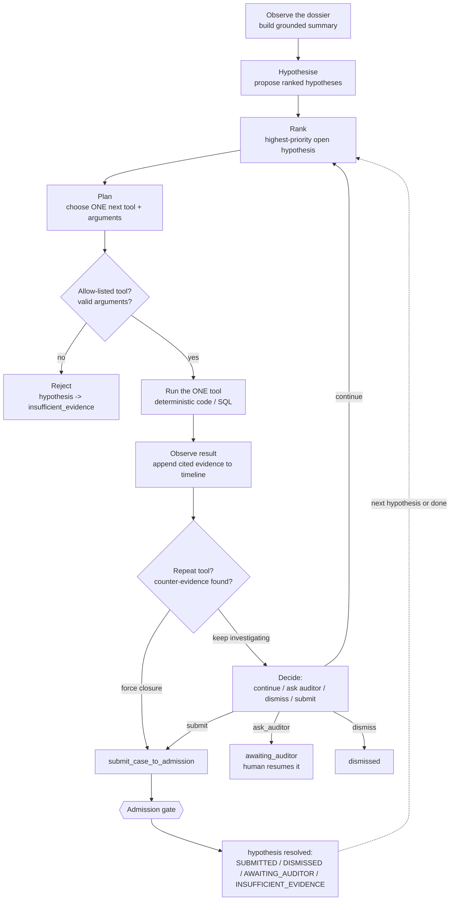
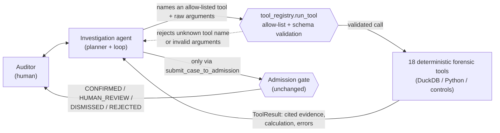

# Evidentia

Evidentia is an autonomous audit investigation agent that follows suspicious
money and control trails, chooses which forensic checks to run, challenges
its own hypotheses, and proves every claim with exact evidence.

> **Models understand. Code verifies. Auditors decide.**

Hand it an **unseen** dossier at judging time — a folder or a `.zip` upload —
and it produces the same class of result it produces on the sample, with zero
code changes: the agent decides *where to look*, but every number, match, and
threshold it cites comes from deterministic code running against a DuckDB
ledger, never from the model.

**Technical summary:** OpenAI plans and interprets. DuckDB and Python verify
the numbers. Cognee remembers and connects the investigation. The existing
admission gate decides whether the case is safe to present to an auditor.

## What it does

Given a folder of GDPdU exports, CSVs, XLSX workbooks, Word policy documents,
and PDF invoices, Evidentia:

1. natively parses every source format and hashes every file and every field
   it reads, preserving exact row/cell/page/passage locators;
2. normalizes bilingual (German/English) amounts and dates with an explicit
   locale — never a guess;
3. loads everything into a local DuckDB ledger as the single source of
   numeric truth;
4. lets an **investigation agent** observe the dossier, propose ranked
   hypotheses, and drive a bounded loop that runs one forensic tool at a
   time — vendor creation/approval, permissions, invoice/payment
   reconciliation, contract/service evidence, peer comparison, split-payment
   clustering, capitalisation, cut-off — building a replayable timeline of
   exactly what it checked and why;
5. runs each hypothesis's declared **counter-evidence** tests — independent
   approval, matching deliverables, prior history, matched accruals — before
   it will let a case be confirmed;
6. submits every resolved hypothesis through the existing **admission gate**,
   which is the only place a verdict (`CONFIRMED` / `HUMAN_REVIEW` /
   `DISMISSED` / `REJECTED`) is decided;
7. emits a `cases.json` replay bundle and an investigation timeline that a
   Next.js console renders read-only, where every displayed number is
   clickable to the exact source locator that produced it.

Dismissed anomalies — cases where a control fired but a genuine innocent
explanation cleared it — are a first-class output, not noise. Correctly
clearing an honest "twin" of a fraud pattern is exactly what a false-positive
penalty is measuring, and Evidentia surfaces those dismissals with the same
evidentiary rigor as a confirmed case.

## Why this is an agent, not a pipeline with a chat window bolted on

A fixed pipeline runs every control on every dossier in a fixed order. An
investigation agent instead **decides where to look**: it forms hypotheses
about which vendor, cluster of payments, or period is worth chasing, ranks
them, runs one real forensic check, reads the result, and only then decides
whether to keep pulling that thread, challenge itself with a counter-test,
ask the auditor a question, or close the case. That loop — not a bigger
prompt — is what makes it an agent.



**Hard limits guarantee termination, not the model's good behaviour:**
`InvestigationLimits` caps the number of hypotheses, the number of loop
steps, the number of tool calls, and wall-clock seconds; if the planner picks
a tool that already ran for the active hypothesis, the loop force-closes it
by submitting to the admission gate instead of looping forever. Every one of
these guards is checked in code before a tool runs — the model cannot
override them. The whole loop is **replayable**: every `Investigation` keeps
an append-only `timeline` of typed events (`hypothesis_created`,
`tool_selected`, `tool_result`, `counter_evidence`, `hypothesis_resolved`,
`stopped`, ...), so a finished or in-progress investigation can be
reconstructed and audited step by step, not just judged by its final state.

### The hierarchy: auditor ↔ agent ↔ forensic tools ↔ admission gate



The agent is never allowed to reach a tool function directly. Every call goes
through `tool_registry.run_tool`, which (a) rejects any name that is not in
the allow-list, (b) validates the raw arguments against that tool's strict
Pydantic schema (`extra="forbid"`), and only then invokes the underlying
function — a hallucinated tool name or a malformed argument produces an
`ok=False` result, never an exception that could crash the loop. The planner
may also only cite evidence ids that already exist in the `EvidenceRegistry`
(`audit_compiler/agent/evidence_registry.py`): ids are derived deterministically
from source coordinates (`source_path|row|sheet|cell|page|raw_value`), so
`registry.validate(...)` rejects any id the model didn't actually receive
from a tool. **The LLM never computes a total, performs a match, applies a
threshold, or declares a verdict** — it only names a next step and, at the
end, asks the admission gate to decide.

The 18 allow-listed tools (`src/audit_compiler/agent/tool_registry.py`):

| Tool | Purpose |
|---|---|
| `inventory_dossier` | List every parsed source table with its columns and row count |
| `search_evidence` | Full-text search across every cell/paragraph/passage, optionally by source type |
| `open_evidence` | Resolve a previously cited evidence id back to its full source pointer |
| `get_vendor_history` | List every posting booked against a vendor account, with a net total |
| `check_vendor_creation_and_approval` | Check whether a vendor's master record was self-approved (creator == approver) |
| `check_user_permissions` | Check whether a user holds a toxic create+post+pay rights combination |
| `reconcile_vendor_invoices_and_payments` | Sum a vendor's invoice legs vs. payment legs and report the unreconciled difference |
| `match_invoice_order_receipt` | Match goods-receipt records to a vendor (or count matches dossier-wide) |
| `cluster_payments` | Find same-day, same-reference payments that individually clear a threshold but aggregate above it |
| `inspect_asset_additions` | Find asset additions with repair/maintenance vocabulary capitalised onto balance-sheet accounts |
| `test_period_cutoff` | Find invoices dated after the balance-sheet date for services delivered before it |
| `find_reversal` | Search posting text for a reversal/storno entry, optionally tied to a document or payment |
| `find_credit_note` | Search posting text for a credit note / Gutschrift, optionally tied to a document or payment |
| `find_independent_approval` | Check whether a vendor's creation carries an independent (four-eyes) approval |
| `find_contract_or_service_evidence` | Search for goods-receipt records and narrative contract/service mentions for a vendor |
| `compare_peer_vendors` | Compare a vendor's exposure against the median and rank of its peers |
| `trace_amount_to_sources` | Find every cell across the dossier whose amount matches a given value |
| `submit_case_to_admission` | Run the matching control for a subject/category, then pass its finding through the admission gate |

A separate, smaller set of **Cognee relationship tools**
(`find_related_entities`, `find_similar_investigation_paths`,
`find_other_vendors_connected_to_user`, `retrieve_open_hypothesis_context` in
`src/audit_compiler/agent/cognee_tools.py`) exists behind the same
`(ctx, args) -> ToolResult` shape for querying investigation memory, but is
not yet merged into the planner's allow-list — see
[`REMAINING_RISKS.md`](REMAINING_RISKS.md).

### Roles

- **OpenAI** (Structured Outputs) generates and ranks hypotheses, picks the
  next tool name (subject to the allow-list + schema boundary above), and
  writes plain-language interpretation and explanations. It never fills in a
  `ToolCalculation` — that field only exists on results real tools return.
  The **hybrid planner is the default** (`get_planner()`): OpenAI proposes
  and ranks hypotheses (the judgement-heavy step) while a deterministic,
  per-category tool plan drives execution and decisions, so a
  reasoning-model slip can change *what* gets investigated but never *how*
  arithmetic runs or *whether* a verdict is trustworthy. A pure
  `OpenAIPlanner` (LLM picks every next tool too) and a pure
  `DeterministicPlanner` (no LLM at all, used offline and in tests) are also
  available behind the same `Planner` protocol
  (`src/audit_compiler/agent/planner.py`).
- **DuckDB / Python** is authoritative for arithmetic, matching, and
  thresholds. Every `ToolCalculation` carries its `expression`, typed
  `inputs` (each cited to an evidence id), the numeric `result`, and — where
  applicable — the `sql` that produced it, so a calculation can be
  re-executed on replay, not just trusted.
- **Cognee cloud** is the investigation's memory and relationship graph
  (`src/audit_compiler/agent/cognee_memory.py`): `add_text` mirrors every
  node/edge write as a short text fact, `cognify` asynchronously builds the
  graph server-side, and `search` (defaulting to the fast `CHUNKS` mode, not
  the LLM-synthesising `GRAPH_COMPLETION` mode) enriches structural query
  results. A local `InMemoryGraph` is the deterministic source of truth for
  every structural query (neighbours, multi-hop traversal) — the Cognee cloud
  mirror is best-effort and additive only; a missing key, unreachable
  network, or non-2xx response is caught, logged, and swallowed, and never
  raises into the agent or changes a result.
- **The admission gate** (unchanged from the v1 pipeline) is the only place a
  verdict is decided: `CONFIRMED`, `HUMAN_REVIEW`, `DISMISSED`, `REJECTED`.
  The loop reaches it only through `submit_case_to_admission`.

See [`ARCHITECTURE.md`](ARCHITECTURE.md) for the full pipeline, the agent
loop, the admission gate's verdict state machine, and the provenance model,
and [`docs/CASES_SCHEMA.md`](docs/CASES_SCHEMA.md) for the exact `cases.json`
contract.

## Provenance guarantees & false-positive safeguards

- Money is always `decimal.Decimal`; floats are rejected at normalization,
  tool-argument, and model boundaries (`ToolCalculation.result`,
  `Hypothesis.candidate_exposure`, etc. all reject a raw `float`).
- Every normalized fact, tool observation, and control result carries one or
  more immutable `EvidenceRef`s (source sha256, exact locator, raw value); an
  id the model cites but the registry never issued is rejected, not silently
  accepted.
- A hypothesis cannot be confirmed without its required counter-evidence
  tests (independent approval, matching deliverables/contract, peer
  comparison, prior history) having actually run — the loop's per-category
  plan runs them before `submit_case_to_admission`, and the admission gate
  itself refuses to confirm a case with an unrun required refuter.
- Dismissed decoys ("honest twins") are a first-class result, not a fallback:
  a hypothesis that a counter-test clears is recorded as `DISMISSED` with the
  same evidence rigor as a confirmed one, and shown that way in the console.
- **Hidden-dossier generalization**: every control and tool resolves columns
  and bilingual (German/English) terms through `audit_compiler.ir.roles` at
  run time — nothing references a sample vendor id, amount, filename, or
  hard-coded column name. The same code is expected to run unmodified against
  the final, unseen dossier.

## ZIP upload demo flow

At judging time the auditor doesn't need filesystem access to the machine
running Evidentia — they upload a `.zip` of the dossier:

1. `POST /engagements/upload` (multipart `file=`) accepts a `.zip`, bounded
   to 200 MiB.
2. The archive is extracted into a fresh temp directory with a **safe
   extractor** that rejects absolute paths, `..` traversal, and symlink
   entries (each rejection resolves the final on-disk path and confirms it
   stays under the target directory) before anything is written.
3. The dossier root is detected (the extracted directory itself, or its
   single top-level folder if the zip wrapped everything in one), copied out
   of the auto-cleaned temp dir so it survives the request, compiled with the
   same `compile_engagement` pipeline used for a local path, and registered
   as a new engagement with its own `AgentContext`.
4. The response returns an `engagement_id`; `POST /investigations` with that
   id starts the agent's investigation loop against the uploaded dossier —
   identical code path to a local `admissible compile`.

## Setup from a fresh clone

Requires Python 3.12 and [uv](https://github.com/astral-sh/uv).

```bash
uv venv --python 3.12 .venv && source .venv/bin/activate && uv pip install -e '.[dev]'
cp .env.example .env   # add keys (all optional — runs deterministically without them)

# Compile a dossier and emit the replay bundle + UI data:
admissible compile /path/to/dossier --cases-out web/public/cases.json

# Serve the investigation + review API:
admissible serve            # FastAPI on http://localhost:8000
```

Frontend:

```bash
cd web && npm install && npm run dev   # http://localhost:3000
```

Other CLI commands:

- `admissible inventory <dossier>` — hash and inventory a dossier's source
  files without compiling them (format, byte count, sha256).
- `admissible compile <dossier>` also accepts `--database` to choose the
  DuckDB file location and `--output` for the raw compilation report; it
  auto-runs the four controls and writes the replay bundle as part of the
  same command.

## Testing

```bash
pytest -q
ruff check .
```

Some tests (the sample-dossier regression suite and the mutation-testing
suite) require a real sample dossier and are skipped unless
`EVIDENTIA_SAMPLE_DOSSIER=/path/to/sample/dossier` is set. Every other test —
partner degradation, agent tools, the investigation loop, planners, Cognee
memory — runs fully offline with no environment variables set.

## Partner technologies

All partner integrations sit behind interfaces with **graceful
degradation** — every unset key simply turns off that layer; the pipeline
and the agent loop still run and still reach a verdict without it.

| Partner | Used for | Degrade behavior |
|---|---|---|
| **OpenAI** (Structured Outputs) | Bilingual terminology normalization, hypothesis generation/ranking, next-tool selection (hybrid/pure-OpenAI planners), and auditor-facing explanations. Model output must cite existing `evidence_id`s and allow-listed tool names; unknown ones are rejected. | With no `OPENAI_API_KEY`, `get_planner()` returns the `DeterministicPlanner` — a genuine, LLM-free planner that still drives real tools against real data — and cases still compile and publish without narrative explanation text. |
| **Cognee** | Investigation memory and a multi-hop relationship graph over entities, hypotheses, and evidence. | With no `COGNEE_API_URL`/`COGNEE_API_KEY` (or `httpx` missing), every write/read falls back to the local, fully-functional `InMemoryGraph`; investigations run identically, just without the cloud mirror. |
| **Tavily** | Optional external verification (e.g. corroborating a vendor's public existence) when `ADMISSIBLE_ENABLE_EXTERNAL=true`. | Off by default and never required. |

## Verdicts

- **`CONFIRMED`** — evidence and deterministic checks support the case;
  required counter-tests ran and none cleared it.
- **`HUMAN_REVIEW`** — suspicious but incomplete, evidence conflicts, or the
  call is judgment-dependent.
- **`DISMISSED`** — a counter-test found a supported innocent explanation.
- **`REJECTED`** — missing provenance, no executable control support, or an
  otherwise invalid case; never published.

## API reference

Review/compile surface (`src/audit_compiler/api/app.py`):

| Method | Path | Purpose |
|--------|------|---------|
| GET | `/health` | Liveness check |
| POST | `/engagements/compile` | Compile a dossier by local filesystem path |
| POST | `/engagements/upload` | Upload a `.zip` dossier, safely extract, compile, and register an engagement — returns `engagement_id` |
| GET | `/cases` | List the compiled engagement's cases (case board) |
| GET | `/cases/{case_id}` | Full replay bundle for one case |
| GET | `/evidence/{evidence_id}` | Resolve an evidence id to its exact source locator and raw value |
| POST | `/cases/{case_id}/review` | Record a human reviewer decision |

Investigation-agent surface (`src/audit_compiler/api/investigations.py`):

| Method | Path | Purpose |
|--------|------|---------|
| POST | `/investigations` | Start an investigation against a compiled/uploaded `engagement_id` + objective; runs `start_investigation` (observe + hypothesise) |
| GET | `/investigations` | List all investigations (id, engagement, objective, status, hypothesis count) |
| GET | `/investigations/{id}` | Full investigation state: hypotheses, completed/pending actions, evidence ids, timeline |
| POST | `/investigations/{id}/run-next` | Advance the active hypothesis by exactly one validated, executed tool call |
| POST | `/investigations/{id}/run` | Run the loop to completion (bounded by `InvestigationLimits`) |
| GET | `/investigations/{id}/timeline` | The append-only, replayable event timeline |
| GET | `/investigations/{id}/graph` | The investigation's local relationship-graph neighborhood (+ best-effort Cognee enrichment) |
| POST | `/investigations/{id}/hypotheses/{hid}/dismiss` | Auditor dismisses a hypothesis directly |
| POST | `/investigations/{id}/hypotheses/{hid}/submit` | Auditor forces submission to the admission gate |
| POST | `/investigations/{id}/hypotheses/{hid}/continue` | Reactivate a hypothesis awaiting the auditor |
| POST | `/investigations/{id}/hypotheses/{hid}/challenge` | Auditor challenges a hypothesis, requesting more evidence; marks it `awaiting_auditor` |
| POST | `/investigations/{id}/messages` | Add a free-text auditor message/question to the investigation |

## Roadmap: native source connectors

Today Evidentia ingests a dossier as files on disk (or a `.zip` of them).
The same provenance-first pipeline generalizes to **live source systems** —
this is designed but **not built**; it is future work.

The extension point would be a `SourceConnector` protocol parallel to the
existing file adapters (`audit_compiler/adapters/`):

```python
class SourceConnector(Protocol):
    def discover(self) -> list[SourceDescriptor]: ...   # what tables/objects exist
    def fetch(self, descriptor: SourceDescriptor) -> Iterator[RawRecord]: ...
    def evidence_ref(self, record: RawRecord) -> EvidenceRef: ...  # locator IS the source system's own record id/version
```

- A **Salesforce connector** would implement `discover` over the objects an
  audit engagement cares about (Accounts, Opportunities, Approvals, custom
  vendor/PO objects) via the Bulk/REST API, and `evidence_ref` would resolve
  to the object's id + field + `LastModifiedDate`/version instead of a row
  number — so a cited fact is still replayable back to "this exact record,
  this exact field, at this exact revision."
- A **database connector** (arbitrary SQL sources) would implement
  `discover` over a configured set of tables/views and `fetch` as a
  read-only, paginated query; `evidence_ref` would resolve to
  `table + primary key + column`, mirroring how CSV/XLSX rows are cited
  today.
- Both would feed the **same** Audit Intermediate Representation, the same
  DuckDB ledger, and the same controls/tools/admission gate — a connector's
  only job is producing typed rows with a resolvable `EvidenceRef`, exactly
  like today's file adapters. No control, tool, or the agent loop would need
  to change.
- Practical gaps to close before this is real: incremental/delta fetch
  (audits re-run against a moving live system, not a frozen export),
  credential/scopes management per engagement, and a policy for what "exact
  evidence" means when the underlying record can be edited after the fact
  (a database row has no immutable byte range the way a source file does).
